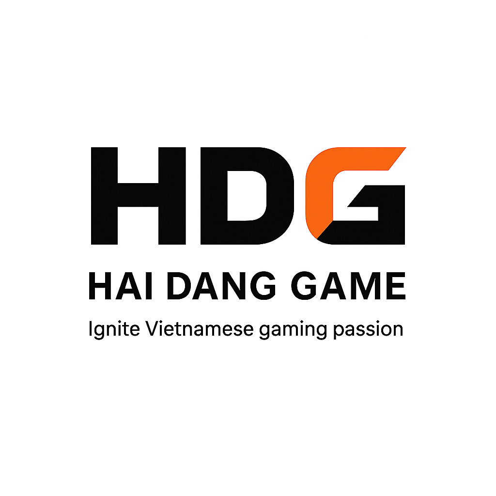

<p align="center">
  
</p>

<h1 align="center">HDG Ecosystem — RIPT1307 Nhóm 01</h1>

<p align="center">
  <strong>Bài tập lớn thực hành lập trình web</strong><br/>
  Phạm Hải Đăng &nbsp;·&nbsp; Lê Đình Thành &nbsp;·&nbsp; Lê Xuân Dũng
</p>

---

## Mục lục

- [Bối cảnh dự án](#bối-cảnh-dự-án)
- [Điểm nổi bật của nhóm](#điểm-nổi-bật-của-nhóm)
- [Tổng quan hệ sinh thái HDG](#tổng-quan-hệ-sinh-thái-hdg)
- [Phạm Hải Đăng — Ngọc Rồng Online Platform](#phạm-hải-đăng--ngọc-rồng-online-platform)
  - [Tổng quan](#tổng-quan)
  - [Kiến trúc hệ thống](#kiến-trúc-hệ-thống)
  - [Client](#client)
  - [Server — Microservices](#server--microservices)
  - [Infra / DevOps](#infra--devops)
  - [Production](#production)
- [Lê Đình Thành — HDG Admin & HR System](#lê-đình-thành--hdg-admin--hr-system)
- [Lê Xuân Dũng — HDG Healthcare Management](#lê-xuân-dũng--hdg-healthcare-management)

---

## Bối cảnh dự án

Thay vì xây dựng một sản phẩm chung như đa số các nhóm khác, **Nhóm 01** lựa chọn hướng tiếp cận khác biệt: mỗi thành viên phát triển một dự án độc lập với ngôn ngữ, công nghệ và hạ tầng riêng — nhưng tất cả cùng thuộc về một **hệ sinh thái thống nhất** mang tên **HDG**.

HDG là một công ty (môi trường giả định trong bài tập lớn) bao gồm nhiều mảng vận hành: nền tảng game online, hệ thống quản trị nội bộ và quản lý nhân sự, và hệ thống chăm sóc sức khỏe nhân viên. Ba dự án của ba thành viên chính là ba mảng đó — tích hợp với nhau, chia sẻ backend và dữ liệu ở những điểm chung, nhưng mỗi người hoàn toàn tự chủ về thiết kế và triển khai phần của mình.

---

## Điểm nổi bật của nhóm

| | Phạm Hải Đăng | Lê Đình Thành | Lê Xuân Dũng |
|---|---|---|---|
| **Dự án** | Ngọc Rồng Online Platform | HDG Admin & HR System | HDG Healthcare Management |
| **Ngôn ngữ chính** | TypeScript (NestJS/NextJS) · Golang · Java (LibGDX) | TypeScript(NextJS/React Native) JavaScript(ExpressJS) | TypeScript(React) Python (FastAPI) |
| **Hạ tầng** | Multi-VPS · Docker · Nginx · Cloudflare | Tận dụng backend HDG + tự dev service | Độc lập, giao diện người dùng riêng |
| **Role** | Full Stack · BA · DevSecOps & SRE · QA | Full Stack · BA · Mobile/Android Dev | Full Stack · BA · QA |

> Mỗi thành viên làm việc độc lập nhưng cùng đóng góp vào **một hệ sinh thái chung** — thể hiện cả khả năng cá nhân lẫn tư duy làm việc nhóm theo hướng phân tán.

---

## Tổng quan hệ sinh thái HDG

```
                        ┌─────────────────────────────┐
                        │        HDG Ecosystem         │
                        └────────────┬────────────────┘
               ┌──────────────────────┼──────────────────────┐
               ▼                      ▼                      ▼
   ┌─────────────────────┐  ┌──────────────────┐  ┌──────────────────────┐
   │  Ngọc Rồng Online   │  │  HDG Admin & HR  │  │  HDG Healthcare Mgmt │
   │   (Hải Đăng)        │  │  (Đình Thành)    │  │   (Xuân Dũng)        │
   │                     │  │                  │  │                      │
   │  Game MMORPG        │  │  Web Admin       │  │  Healthcare System   │
   │  Web Platform       │  │  Android App     │  │  Python FastAPI      │
   │  14 Microservices   │  │  HR Management   │  │  User Interface      │
   └─────────────────────┘  └──────────────────┘  └──────────────────────┘
               │                      │
               └──────────────────────┘
               Dùng chung backend HDG (auth, user, pay...)
```

---

## Phạm Hải Đăng — Ngọc Rồng Online Platform

> **Role:** Full Stack Engineer · Business Analyst · DevOps  
> **Ngôn ngữ:** TypeScript (NestJS) · Golang · Java (LibGDX)

### Tổng quan

Ngọc Rồng Online là một nền tảng game MMORPG đa người chơi, tái hiện tựa game tuổi thơ của nhiều thế hệ game thủ Việt — **Ngọc Rồng**. Dự án không chỉ bao gồm game client mà còn là một **hệ sinh thái đầy đủ**: từ web người dùng, hệ thống thanh toán, chatbot AI, đến hạ tầng phân tán chạy production 24/7.

Ngoài vai trò kỹ thuật, Hải Đăng còn đảm nhận **Business Analyst** — phân tích yêu cầu, thiết kế luồng nghiệp vụ và đảm bảo tính nhất quán của toàn bộ hệ sinh thái.

---

### Kiến trúc hệ thống

```
Internet
   │
   ▼
Cloudflare (DDoS protection, CDN, Tunnel)
   │
   ▼
Nginx (Load Balancer · Reverse Proxy · SSL Termination)
   │
   ├──► API Gateway (NestJS) ──► 11 NestJS Microservices
   │                          ──► 1 Go Service (WebSocket Game)
   │
   ├──► Web User (Next.js)
   ├──► Web Admin
   └──► Game Client (LibGDX / Android)

Databases: MySQL · PostgreSQL · MongoDB (mỗi service 1 DB riêng)
Message Queue: RabbitMQ
Cache: Redis
Service Mesh: gRPC + Protocol Buffers
Real-time: NATS + WebSocket (custom binary protocol)
```

**Tổng cộng: 14 microservices · 47 instances · chạy 24/7 trên multi-VPS**

---

### Client

#### 🌐 Web User — `dragonboy-web`
> [github.com/DANG-PH/dragonboy-web](https://github.com/DANG-PH/dragonboy-web)

Nền tảng web đầy đủ tính năng cho Ngọc Rồng Online:

- 🛒 **Item Shop** — mua sắm vật phẩm trong game
- 📦 **Account Market** — giao dịch tài khoản giữa người chơi
- 🏆 **Leaderboards** — bảng xếp hạng thời gian thực
- 💬 **Real-time Chat** — nhắn tin trực tiếp
- 💳 **PayOS Wallet** — nạp tiền qua QR, quản lý ví
- 🎉 **Events** — hệ thống sự kiện game
- 🤖 **RAG-powered Chatbot** — chatbot AI hỗ trợ người chơi (Retrieval-Augmented Generation)

#### 🎮 Game Client — `ngoc-rong-online`
> [github.com/DANG-PH/ngoc-rong-online](https://github.com/DANG-PH/ngoc-rong-online)

Game MMORPG viết bằng **LibGDX (Java)**, hỗ trợ:

- Chơi đa người chơi cùng lúc (multiplayer real-time)
- Giao dịch vật phẩm giữa nhân vật
- Hệ thống nạp thẻ tích hợp
- Các tính năng quen thuộc của Ngọc Rồng gốc

---

### Server — Microservices

Toàn bộ backend được tổ chức theo kiến trúc **microservices**, giao tiếp nội bộ qua **gRPC + Protocol Buffers**, exposed ra ngoài qua **API Gateway**.

#### 🚪 API Gateway — `dragonboy-api-gateway`
Cổng vào duy nhất của toàn hệ thống. Xử lý routing, authentication middleware, rate limiting, observability và bảo mật tầng application.

#### 🎮 Game Service (NestJS) — `dragonboy-game-service`
Xử lý business logic phức tạp và các game event có trạng thái (stateful). Phối hợp với Go service để tách biệt giữa logic nghiệp vụ và real-time processing.

#### ⚡ Game Service (Go) — `dragonboy-game-service-go`
High-performance real-time server viết bằng **Golang**:
- Raw WebSocket với **custom binary protocol** (tối ưu bandwidth)
- **NATS** message broker cho pub/sub nội bộ
- Tick processing tần số cao, độ trễ thấp
- Đồng bộ trạng thái game theo thời gian thực

#### 👤 User Service — `dragonboy-user-service`
Quản lý toàn bộ dữ liệu người chơi:
- Profile, game state persistence
- In-game economy (gold & gems)
- Web item inventory
- Leaderboards (via gRPC)

#### 🔐 Auth Service — `dragonboy-auth-service`
- OTP 2FA, Google OAuth, JWT với refresh token
- Token versioning (vô hiệu hóa token từ xa)
- Admin-level user control via gRPC

#### 📦 Item Service — `dragonboy-item-service`
gRPC microservice quản lý inventory:
- Full CRUD vật phẩm
- Bulk insert, UUID-based lookup
- Item swapping, database indexing tối ưu

#### 💰 Payment Service — `dragonboy-pay-service`
- Player wallets với idempotency-safe balance updates
- QR pay order generation (tích hợp PayOS)
- Account lock/unlock
- Finance transaction history + admin analytics

#### 🗂️ Game Data Service — `dragonboy-game-data-service`
Source of truth cho toàn bộ static game content:
- Master data cho maps, NPCs, item definitions
- NPC shops management
- Exposed via gRPC

#### 🤝 Social Network Service — `dragonboy-social-network-service`
Backbone xã hội của game:
- Friendship lifecycle (pending / accept / block / unfriend)
- Private chat, group rooms
- Threaded comment trees với per-user like state
- In-game notifications — tất cả qua gRPC

#### 📧 Queue Service — `dragonboy-queue-service`
Async processing qua **RabbitMQ**:
- Email dispatch (single & bulk)
- Item sync & swap processing
- Retry logic, horizontal scaling

#### 🎓 Disciple Service — `dragonboy-disciple-service`
- Quản lý hệ thống đệ tử trong game
- Power tracking, game state persistence per player
- gRPC + Protocol Buffers

#### 🛡️ Admin Service — `dragonboy-admin-service`
Internal service cho vận hành nội bộ:
- Role-based access (editor / cashier / account marketplace)
- Finance và partner operations
- Workflows qua gRPC

---

### Infra / DevOps

#### 🔄 DevOps Service — `dragonboy-devops-service`
Central deployment hub của toàn hệ sinh thái:
- Nhận trigger từ 14 services
- Orchestrate automated deployments qua **3 VPS độc lập**
- CI/CD pipeline tự động

#### 🌐 Nginx Service — `dragonboy-nginx-service`
- Load balancing, reverse proxy
- SSL termination (Let's Encrypt / Cloudflare)
- Full Docker Compose stack trên dedicated VPS
- Chạy cùng database layer

#### 🛡️ Bảo mật — Defense in Depth

Hệ thống áp dụng chiến lược bảo mật nhiều tầng:

```
Tầng 1: Cloudflare — DDoS mitigation, WAF, Tunnel (ẩn IP VPS thật)
Tầng 2: Nginx — Rate limiting, IP filtering, SSL
Tầng 3: API Gateway — Auth middleware, input validation
Tầng 4: Application — Business logic security, gRPC auth
Tầng 5: Database — Isolated per-service, network segmentation
```

#### 🧪 Testing

- **Stress test & Soak test** cho toàn bộ server layer
- **Unit test cases** cho game client
- Load testing để validate horizontal scaling

---

### Production

| Endpoint | Mô tả |
|---|---|
| [ngocrongdark.com](https://ngocrongdark.com) | Tải game & chơi |
| [api.ngocrongdark.com](https://api.ngocrongdark.com) | API Gateway (production) |
| [download.ngocrongdark.com](https://download.ngocrongdark.com) | Release & cập nhật game |
| [data.ngocrongdark.com](https://data.ngocrongdark.com) | Database management (tập trung) |
| [redis.ngocrongdark.com](https://redis.ngocrongdark.com) | Redis monitoring GUI |

---

## Lê Đình Thành — HDG Admin & HR System

> **Role:** Full Stack Engineer · Mobile Developer  
> **Ngôn ngữ:** TypeScript / JavaScript · (Android)

### Tổng quan

Lê Đình Thành xây dựng hệ thống **quản trị nội bộ và quản lý nhân sự** cho công ty HDG. Dự án bao gồm:

- **Web Admin** — Giao diện quản trị sử dụng backend của Hải Đăng, tích hợp vào hệ sinh thái HDG
- **Android App** — Ứng dụng di động cho nhân viên và quản lý
- **Web đặt lịch** — Hệ thống đặt lịch làm việc, quản lý ca, nhân sự
- **Tự phát triển thêm service backend riêng** phục vụ các nghiệp vụ HR đặc thù

> ✏️ *Mục này sẽ được Lê Đình Thành bổ sung chi tiết.*

---

## Lê Xuân Dũng — HDG Healthcare Management

> **Role:** Backend Developer · Frontend Developer  
> **Ngôn ngữ:** Python (FastAPI)

### Tổng quan

Lê Xuân Dũng xây dựng hệ thống **quản lý sức khỏe nhân viên** cho công ty HDG, bao gồm:

- **Healthcare Management System** — Backend viết bằng **Python FastAPI**
- **Giao diện người dùng** — UI cho nhân viên và bộ phận y tế nội bộ
- Quản lý hồ sơ sức khỏe, lịch khám, theo dõi tình trạng nhân viên

Hệ thống hoạt động độc lập về mặt hạ tầng nhưng kết nối với hệ sinh thái HDG chung thông qua dữ liệu nhân sự và xác thực người dùng.

> ✏️ *Mục này sẽ được Lê Xuân Dũng bổ sung chi tiết.*

---

<p align="center">
  <sub>HDG Ecosystem · RIPT1307 Nhóm 01 · 2024–2025</sub>
</p>
